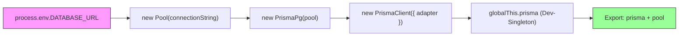
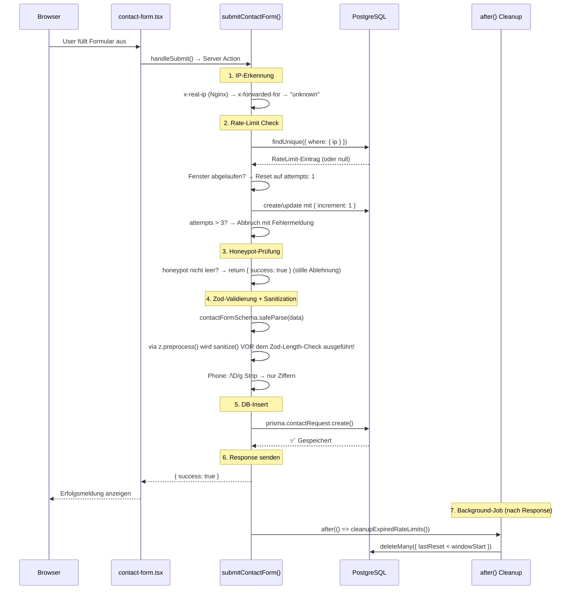
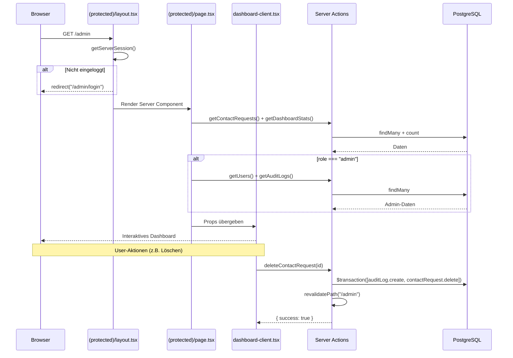
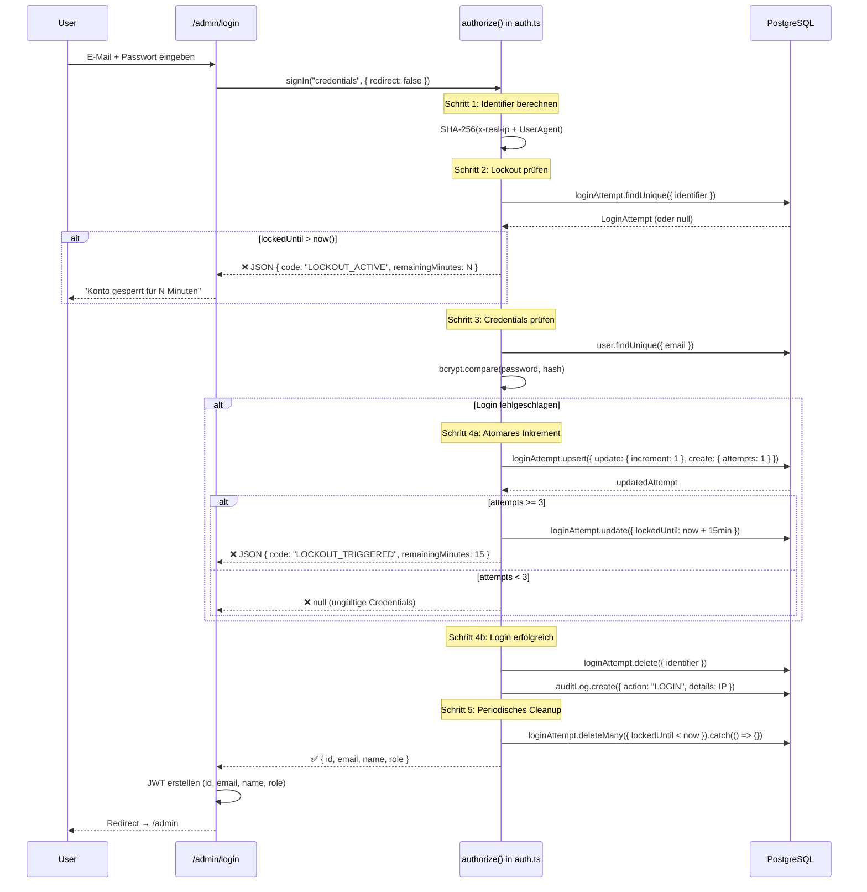
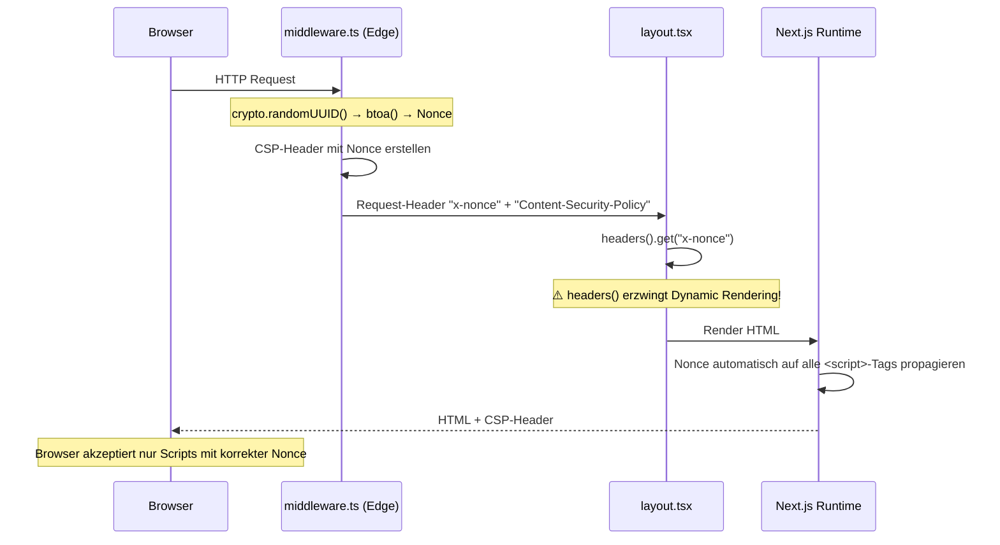
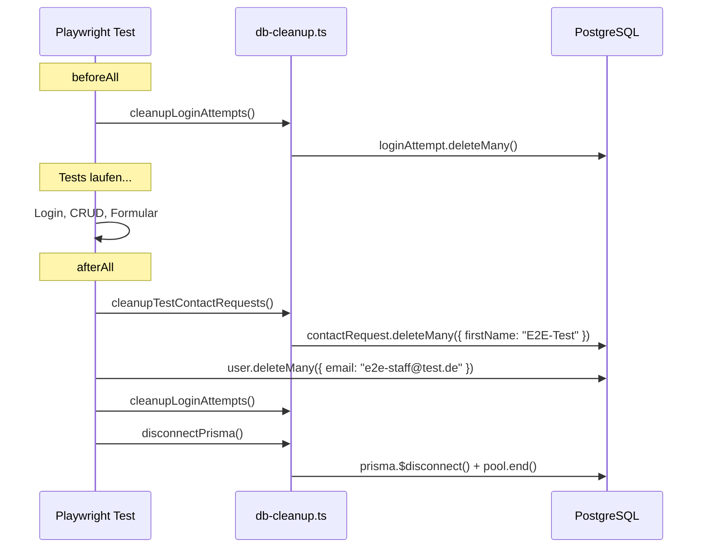
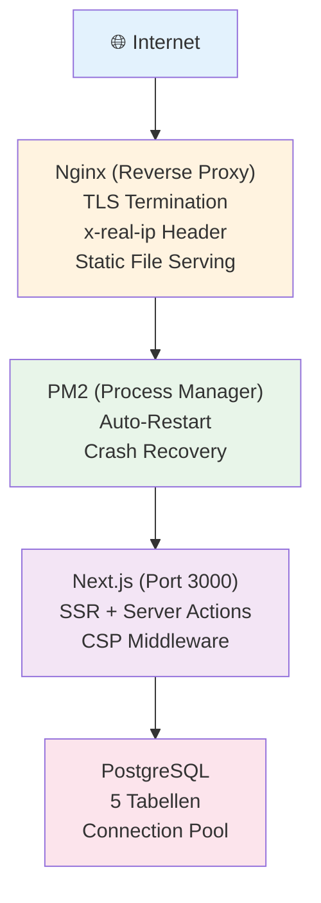
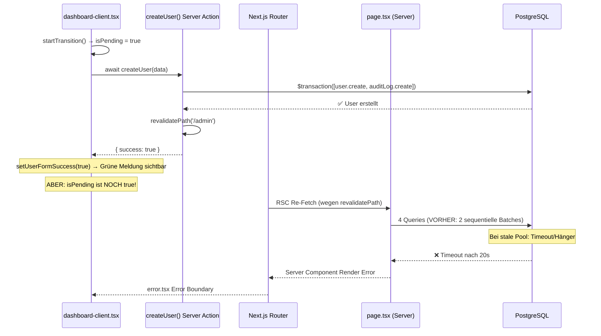

# 📐 Projektdokumentation — Zahnarztpraxis Dr. Peter Neumann

> **Single Source of Truth** für Architektur, Datenfluss und Security-Konzepte.
> Jeder neue Entwickler soll dieses Dokument lesen und die gesamte Anwendung sofort zu 100 % verstehen.

---

## Inhaltsverzeichnis

1. [🚀 Executive Summary & Tech Stack](#-1-executive-summary--tech-stack)
2. [📂 Projektstruktur & Konventionen](#-2-projektstruktur--konventionen)
3. [🗄️ Datenbankschicht & Prisma 7](#-3-datenbankschicht--prisma-7)
4. [🔄 Datenfluss & Server Actions](#-4-datenfluss--server-actions)
5. [🔐 Authentifizierung & Autorisierung](#-5-authentifizierung--autorisierung)
6. [🛡️ Security, DSGVO & Härtung](#-6-security-dsgvo--härtung)
7. [🧪 E2E-Testing](#-7-e2e-testing)
8. [⚙️ Operations & Deployment](#-8-operations--deployment)
9. [📖 Developer Runbook](#-9-developer-runbook)

---

## 🚀 1. Executive Summary & Tech Stack

### Was ist dieses Projekt?

Eine DSGVO-konforme Marketing-Website mit rollenbasiertem Admin-Panel für die **Zahnarztpraxis Dr. Peter Neumann** in Zeitz. Die Anwendung besteht aus zwei Teilen:

1. **Öffentliche Website** (`/`) — Praxis-Vorstellung, Sprechzeiten, Kontaktformular
2. **Admin-Panel** (`/admin`) — Kontaktanfragen verwalten, Benutzerverwaltung, Audit-Logs

| Eigenschaft       | Wert                                                              |
| ----------------- | ----------------------------------------------------------------- |
| **Domain**        | zeitzer-zahnarzt.de                                               |
| **Sprache**       | Deutsch (de_DE)                                                   |
| **DSGVO-Status**  | Vollständig konform — keine externen Dienste, kein Tracking       |
| **Hosting**       | Aktuell Vercel (Migration auf Self-Hosted mit Nginx/PM2 möglich)  |

### Praxis-Daten (zentral in `src/content/data.ts`)

- **Name:** Dr. Peter Neumann
- **Adresse:** Platz der Deutschen Einheit 5, 06712 Zeitz
- **Telefon:** 03441 223786
- **Admin-E-Mail:** admin@zeitzer-zahnarzt.de
- **Single Source of Truth:** `src/content/data.ts` versorgt öffentliche Komponenten, Rechtstexte und Metadaten

### Tech-Stack

| Schicht        | Technologie                  | Version    | Zweck & Begründung                                                     |
| -------------- | ---------------------------- | ---------- | ---------------------------------------------------------------------- |
| Framework      | Next.js (App Router)         | ^15.2.4    | SSR, Server Actions, Edge Middleware, `after()` API für Background-Jobs |
| UI             | React                        | ^19.0.0    | Komponenten-Rendering mit Server/Client-Split                          |
| Sprache        | TypeScript                   | ^5.7.3     | Compile-Time Typsicherheit, IDE-Autocomplete                           |
| Styling        | Tailwind CSS                 | ^3.4.17    | Utility-First CSS — kein Runtime-CSS-Overhead                          |
| UI-Bibliothek  | Shadcn UI (Radix Primitives) | —          | Barrierefreie Basis-Komponenten, manuell in `/ui` verwaltet            |
| Animationen    | Framer Motion                | ^12.4.7    | Scroll-Animationen (`useInView`), Page-Transitions                     |
| Icons          | Lucide React                 | ^0.474.0   | Tree-shakeable SVG-Icons                                               |
| ORM            | Prisma + @prisma/adapter-pg  | ^7.7.0     | Type-safe DB-Zugriff via nativen `pg` Pool (kein Rust-Binary)          |
| Datenbank      | PostgreSQL                   | —          | 5 Tabellen: Kontakte, User, Lockouts, Audit, Rate-Limits              |
| Auth           | NextAuth.js v4               | ^4.24.11   | JWT-basiert, CredentialsProvider, DB-basierter Lockout                 |
| Validierung    | Zod                          | ^4.3.6     | Deklarative Schema-Validierung mit Enum-Whitelists                     |
| Passwort-Hash  | bcryptjs                     | ^2.4.3     | 12 bcrypt-Runden — Brute-Force-resistent                              |
| Schrift        | Inter (via next/font)        | —          | Build-Time Download → Self-Hosting (DSGVO: kein Google-Request)        |
| E2E-Tests      | Playwright                   | ^1.59.1    | 3 Suites, 10 Tests — Chromium (Desktop + Mobile)                      |

### Rendering-Strategie

Alle Seiten werden **dynamisch (SSR)** gerendert. Der Grund: Das Root Layout (`layout.tsx`) ruft `headers()` auf, um die CSP-Nonce aus der Middleware auszulesen — das erzwingt Dynamic Rendering für den gesamten Render-Tree. Static Export ist damit ausgeschlossen, was für per-Request-Nonces aber **zwingend erforderlich** ist.

| Route               | Typ              | Grund                                                        |
| -------------------- | ---------------- | ------------------------------------------------------------ |
| `/`                  | Dynamic (SSR)    | Root Layout nutzt `headers()` → kein Static Export möglich   |
| `/impressum`         | Dynamic (SSR)    | Erbt Dynamic Rendering vom Root Layout                       |
| `/datenschutz`       | Dynamic (SSR)    | Erbt Dynamic Rendering vom Root Layout                       |
| `/admin`             | Dynamic (SSR)    | `export const dynamic = "force-dynamic"` — DB + Session      |
| `/admin/login`       | Client Component | Interaktives Login-Formular mit State                        |
| `/api/auth/[...]`    | API Route        | NextAuth.js Handler                                          |

### Komponenten-Übersicht

| Datei                | Server/Client | Besonderheiten                                                     |
| -------------------- | ------------- | ------------------------------------------------------------------ |
| `navbar.tsx`         | Client        | Framer Motion, Hamburger (44×44px Touch-Target), `fixed` Position  |
| `hero.tsx`           | Client        | Fade-in Animationen, Bento-Box-Cards, `h-12` CTAs                 |
| `about.tsx`          | Client        | `useInView` Scroll-Trigger, 4 Feature-Icons im Grid               |
| `schedule.tsx`       | Client        | `useInView`, Barrierefreiheits-Hinweis (Lucide Accessibility)      |
| `contact-form.tsx`   | Client        | Ländervorwahl-Dropdown (responsive), Honeypot, DSGVO-Checkbox      |
| `footer.tsx`         | **Server**    | Kein State → Server Component. Links zu /impressum, /datenschutz   |
| `cookie-banner.tsx`  | Client        | `AnimatePresence`, 1.5s Verzögerung, `w-full sm:w-auto` Buttons   |
| `dashboard-client.tsx` | Client      | 3 Tabs (Anfragen, Benutzer, Logs), Server Actions als Callbacks    |
| `ui/button.tsx`      | Client        | CVA (variant, size), `asChild` via Radix Slot                      |
| `ui/input.tsx`       | Client        | `forwardRef`, Shadcn-Konvention                                    |
| `ui/textarea.tsx`    | Client        | `forwardRef`, Shadcn-Konvention                                    |

---

## 📂 2. Projektstruktur & Konventionen

### Dateibaum

```
d:\website\
├── .env                              # Umgebungsvariablen (gitignored)
├── .env.example                      # Vorlage für .env
├── ARCHITECTURE.md                   # ← DIESES DOKUMENT
├── README.md                         # Deployment-Guide (PM2, Nginx, SSL)
├── package.json
├── tsconfig.json
├── next.config.ts                    # Security Headers (HSTS, X-Frame-Options, etc.)
├── tailwind.config.ts                # Farben, Schatten, Fonts
├── postcss.config.js                 # PostCSS für Tailwind
├── prisma.config.ts                  # Prisma CLI Config (DATABASE_URL via dotenv)
├── playwright.config.ts              # E2E-Test-Konfiguration
│
├── prisma/
│   ├── schema.prisma                 # Datenbank-Schema (5 Models)
│   └── seed.ts                       # Admin-User Seeding (upsert, pool.end())
│
├── src/
│   ├── middleware.ts                  # CSP-Nonce Middleware (Edge Runtime)
│   ├── app/
│   │   ├── layout.tsx                # Root Layout (Nonce, Inter-Font, Metadata)
│   │   ├── page.tsx                  # Startseite (/)
│   │   ├── impressum/page.tsx        # Impressum (/impressum)
│   │   ├── datenschutz/page.tsx      # Datenschutz (/datenschutz)
│   │   ├── admin/
│   │   │   ├── layout.tsx            # Admin Layout (bare wrapper — KEIN Auth)
│   │   │   ├── login/page.tsx        # Login-Seite (frei zugänglich)
│   │   │   └── (protected)/          # ← Route Group mit Auth-Guard
│   │   │       ├── layout.tsx        # getServerSession → redirect("/admin/login")
│   │   │       ├── page.tsx          # Dashboard (Server Component — lädt Daten)
│   │   │       ├── dashboard-client.tsx  # Dashboard (Client — rendert UI)
│   │   │       ├── error.tsx         # Error Boundary
│   │   │       └── loading.tsx       # Loading Skeleton
│   │   └── api/auth/[...nextauth]/
│   │       └── route.ts              # NextAuth API Handler
│   │
│   ├── components/
│   │   ├── navbar.tsx                # Sticky Navigation (Client)
│   │   ├── hero.tsx                  # Hero-Bereich (Client)
│   │   ├── about.tsx                 # Über uns (Client)
│   │   ├── schedule.tsx              # Sprechzeiten (Client)
│   │   ├── contact-form.tsx          # Kontaktformular (Client)
│   │   ├── footer.tsx                # Footer (Server!)
│   │   ├── cookie-banner.tsx         # DSGVO Cookie-Banner (Client)
│   │   └── ui/                       # Shadcn Basis-Komponenten
│   │       ├── button.tsx
│   │       ├── input.tsx
│   │       └── textarea.tsx
│   │
│   ├── lib/
│   │   ├── prisma.ts                 # Prisma Client Singleton (pg Pool + Adapter)
│   │   ├── auth.ts                   # NextAuth Config (Lockout, Rollen, Audit)
│   │   ├── actions.ts                # Server Actions (Formular + Admin CRUD)
│   │   ├── schemas.ts                # Zod-Schemas, sanitize(), ERROR_MESSAGES
│   │   ├── rate-limit.ts             # DB-basiertes Rate-Limiting (3 req/min)
│   │   ├── country-codes.ts          # 46 europäische Ländervorwahlen ({code, country})
│   │   └── utils.ts                  # cn() Utility (clsx + tailwind-merge)
│   │
│   ├── generated/prisma/             # Generierter Prisma Client (gitignored)
│   ├── types/next-auth.d.ts          # NextAuth Type Augmentation (id, role)
│   └── styles/globals.css            # Tailwind Directives + CSS-Variablen
│
└── tests/e2e/                        # Playwright E2E-Tests
    ├── contact.spec.ts               # Kontaktformular + Honeypot
    ├── auth.spec.ts                  # Login + Lockout
    ├── admin-dashboard.spec.ts       # Dashboard CRUD + Auth-Redirect
    └── helpers/db-cleanup.ts         # Shared Prisma-Client für Test-Teardown
```

### Konventionen

| Regel                    | Beispiel                                       |
| ------------------------ | ---------------------------------------------- |
| Sprache im Code          | Englisch (Variablen, Funktionen), Deutsch (UI-Texte, Kommentare) |
| Komponenten              | Named Exports: `export function Navbar()`      |
| Seiten                   | Default Exports: `export default function HomePage()` |
| Server Actions           | `src/lib/actions.ts` (`"use server"`), Schemas in `schemas.ts`, Rate-Limiting in `rate-limit.ts` |
| Datei-Benennung          | kebab-case: `contact-form.tsx`, `cookie-banner.tsx` |
| Import-Alias             | `@/` → `src/` (via `tsconfig.json`)           |
| `"use client"` Direktive | Nur bei Interaktivität (State, Events, Animationen) |
| Shadcn-Komponenten       | Manuell in `src/components/ui/` — **kein** `npx shadcn-ui add` |
| `cn()` Utility           | Alle UI-Komponenten nutzen `cn()` aus `@/lib/utils` (clsx + tailwind-merge) |
| Kein `"type": "module"`  | In `package.json` — Next.js App Router Kompatibilität |

### Design-System (Kurzreferenz)

**Farben:** Primary Blue `#1E6BB8` (500) mit Abstufungen `primary-50` bis `primary-900` · Primary Dark `#0F4C81` · Primary Light `#E8F4FD` · Slate 750 `#293548`

**Typografie:** Inter via `next/font/google` (Build-Time Download, self-hosted) · CSS-Variable `--font-inter` · Tailwind `font-sans` Fallback-Stack

**Schatten:** `shadow-card` `0 4px 24px rgba(30,107,184,0.08)` · `shadow-card-hover` `0 8px 40px rgba(30,107,184,0.15)`

**Animationen:** Framer Motion `useInView` mit `once: true` · Pattern: `initial={{ opacity: 0, y: 30 }}` → `animate={{ opacity: 1, y: 0 }}` · Cookie-Banner: `AnimatePresence` + Spring-Transition

---

## 🗄️ 3. Datenbankschicht & Prisma 7

### Warum Prisma 7 mit nativem `pg` Pool?

Prisma 7 hat die eingebaute Rust-Query-Engine entfernt. Stattdessen setzt es auf **Driver Adapters** — in unserem Fall `@prisma/adapter-pg`, der einen nativen Node.js `pg` Pool erwartet.

**Warum das besser ist:**
- ❌ **Kein Rust-Binary** → kleinerer Build (~30 MB weniger), schnelleres Cold Start auf Vercel
- 🔧 **Nativer Connection Pool** → volle Kontrolle über Pool-Größe, Timeouts, Idle-Konfiguration
- 🔒 **Singleton-Pattern** → Pool und PrismaClient werden über `globalThis` dedupliziert, um Connection-Leaks bei Hot-Module-Replacement (HMR) im Dev-Modus zu verhindern
- 📦 **Gleicher Pool überall** → `prisma/seed.ts` importiert denselben Singleton und ruft `pool.end()` zum sauberen Beenden

### Prisma-Architektur im Detail



**`src/lib/prisma.ts` — Der Singleton im Detail:**

```typescript
// 1. Pool erstellen (oder aus globalThis wiederverwenden)
// KRITISCH: Serverless-optimierte Timeouts + Eager Warmup
const isNewPool = !globalForPrisma.pool;
const pool = globalForPrisma.pool ?? new Pool({
  connectionString,
  max: 5,                        // Serverless: 5 statt default 10
  connectionTimeoutMillis: 10000, // 10s — genug für Neon Cold-Start (bis 7s)
  idleTimeoutMillis: 30000,       // 30s statt 10s
});

// Eager Warmup: Beim Cold Start sofort eine Connection aufbauen,
// damit die erste echte Query nicht auf Neon's Wake-Up warten muss
if (isNewPool) {
  pool.connect().then(c => c.release()).catch(() => {});
}

// 2. Adapter erstellen
const adapter = new PrismaPg(pool);

// 3. PrismaClient mit Adapter initialisieren
const prisma = globalForPrisma.prisma ?? new PrismaClient({ adapter });

// 4. Im Dev-Modus: Instanzen auf globalThis speichern
//    → Nächster HMR-Reload findet sie dort und erstellt KEINE neuen
if (process.env.NODE_ENV !== "production") {
  globalForPrisma.prisma = prisma;
  globalForPrisma.pool = pool;
}
```

> **Warum `connectionTimeoutMillis: 10000`?** Neon Serverless Postgres (Free/Pro Tier) braucht bis zu 7s zum Aufwachen aus dem Suspended-State. Mit 5s Timeout schlug der allererste Request nach Deploy/Cold-Start fehl, weil die DB-Connection nicht rechtzeitig stand. 10s gibt genug Puffer. Der Eager Warmup startet die Connection parallel zum Lambda-Boot, sodass sie meist schon steht, wenn die erste Query kommt.

### Drei Konfigurationsdateien — und warum

| Datei | Kontext | Lädt DB-URL aus | Zweck |
| ----- | ------- | --------------- | ----- |
| `prisma/schema.prisma` | Prisma Generator | — (kein `url` im datasource!) | Schema-Definition, Generator-Config (`prisma-client-js`), Output nach `src/generated/prisma`, `previewFeatures: ["driverAdapters"]` |
| `prisma.config.ts` | Prisma CLI (`db push`, `generate`) | `dotenv/config` → `env("DATABASE_URL")` | Stellt die DB-URL für CLI-Operationen bereit. **Ohne diese Datei** würde `npx prisma db push` ohne Verbindung scheitern, da `schema.prisma` bewusst kein `url`-Feld hat. |
| `src/lib/prisma.ts` | App-Runtime | `process.env.DATABASE_URL` → Pool | Singleton für den gesamten Anwendungscode. Wird auch von `prisma/seed.ts` importiert. |

### Datenmodelle (5 Tabellen)

> **Namenskonvention:** Prisma-Felder sind camelCase, DB-Spalten sind snake_case (`@map`), Tabellen ebenfalls (`@@map`). So bleibt der TypeScript-Code idiomatisch, während die DB-Spalten PostgreSQL-Konventionen folgen.

#### 📋 ContactRequest (`contact_requests`)

Kontaktanfragen von Patienten über das Website-Formular. DSGVO-Hinweis: Einträge können unwiderruflich gelöscht werden (Art. 17 — Recht auf Löschung).

| Feld          | Typ      | Default   | Beschreibung                          |
| ------------- | -------- | --------- | ------------------------------------- |
| `id`          | String   | cuid()    | Primärschlüssel                       |
| `firstName`   | String   | —         | Vorname (DB: `first_name`)            |
| `lastName`    | String   | —         | Nachname (DB: `last_name`)            |
| `countryCode` | String   | "+49"     | Ländervorwahl (DB: `country_code`)    |
| `phone`       | String   | —         | Telefonnummer (nur Ziffern)           |
| `message`     | String   | —         | Anliegen (`@db.Text`)                 |
| `gdprConsent` | Boolean  | true      | DSGVO-Einwilligung (DB: `gdpr_consent`) |
| `read`        | Boolean  | false     | Gelesen-Status                        |
| `createdAt`   | DateTime | now()     | Erstellungszeitpunkt (DB: `created_at`) |

#### 👤 User (`users`)

Admin-/Mitarbeiter-Benutzer für den geschützten Verwaltungsbereich.

| Feld        | Typ      | Default   | Beschreibung                          |
| ----------- | -------- | --------- | ------------------------------------- |
| `id`        | String   | cuid()    | Primärschlüssel                       |
| `email`     | String   | —         | Unique, Login-E-Mail (lowercase)      |
| `password`  | String   | —         | bcrypt-Hash (12 Runden, via bcryptjs) |
| `name`      | String?  | —         | Anzeigename (optional)                |
| `role`      | String   | "staff"   | `"admin"` (Vollzugriff) oder `"staff"` (nur Anfragen) |
| `createdAt` | DateTime | now()     | Erstellungszeitpunkt                  |

#### 🔒 LoginAttempt (`login_attempts`)

DB-basiertes Login-Lockout. Identifier = SHA-256(IP + UserAgent) — nicht umkehrbar, DSGVO-konform.

| Feld          | Typ       | Default | Beschreibung                           |
| ------------- | --------- | ------- | -------------------------------------- |
| `id`          | String    | cuid()  | Primärschlüssel                        |
| `identifier`  | String    | —       | SHA-256(IP + UserAgent), **Unique**    |
| `attempts`    | Int       | 0       | Fehlversuche seit letztem Reset        |
| `lockedUntil` | DateTime? | null    | Sperrzeitpunkt (null = nicht gesperrt) |
| `updatedAt`   | DateTime  | auto    | Letztes Update (`@updatedAt`)          |

#### 📜 AuditLog (`audit_logs`)

Protokolliert Admin-Aktionen. Nur für Admin-Benutzer sichtbar. Automatische Retention: >6 Monate werden gelöscht.

| Feld        | Typ      | Beschreibung                                                          |
| ----------- | -------- | --------------------------------------------------------------------- |
| `id`        | String   | cuid()                                                                |
| `userId`    | String   | ID des handelnden Benutzers (DB: `user_id`)                           |
| `userName`  | String   | Anzeigename zum Zeitpunkt der Aktion (DB: `user_name`)                |
| `action`    | String   | `LOGIN` · `DELETE_REQUEST` · `CREATE_USER` · `DELETE_USER` · `CLEAR_LOGS` |
| `details`   | String?  | Freitext-Details (`@db.Text`)                                         |
| `createdAt` | DateTime | Zeitpunkt der Aktion (DB: `created_at`)                               |

#### ⏱️ RateLimit (`rate_limits`)

DB-basiertes Rate-Limiting für öffentliche Endpunkte. Ersetzt die In-Memory `Map`, damit das Limit serverless-/multi-instance-sicher ist.

| Feld        | Typ      | Default | Beschreibung                          |
| ----------- | -------- | ------- | ------------------------------------- |
| `id`        | String   | cuid()  | Primärschlüssel                       |
| `ip`        | String   | —       | Client-IP, **Unique**                 |
| `attempts`  | Int      | 0       | Anfragen im aktuellen Zeitfenster     |
| `lastReset` | DateTime | now()   | Fenster-Startzeitpunkt (DB: `last_reset`) |

### Datenbank-Indizes

Jeder Index hat einen konkreten Grund — keine "Nice-to-have"-Indizes:

| Modell           | Index                        | Begründung                                                    |
| ---------------- | ---------------------------- | ------------------------------------------------------------- |
| `ContactRequest` | `@@index([createdAt])`       | Sortierung `orderBy: { createdAt: "desc" }` im Dashboard      |
| `AuditLog`       | `@@index([createdAt])`       | Retention-Cleanup: `deleteMany({ where: { createdAt: { lt: sixMonthsAgo } } })` |
| `LoginAttempt`   | `@@index([lockedUntil])`     | Lockout-Cleanup: `deleteMany({ where: { lockedUntil: { lt: now } } })` |
| `RateLimit`      | `@@index([lastReset])`       | Fenster-Cleanup: `deleteMany({ where: { lastReset: { lt: windowStart } } })` |

---

## 🔄 4. Datenfluss & Server Actions

Server Actions leben in `src/lib/actions.ts` (Direktive `"use server"`). Zod-Schemas, die `sanitize()`-Funktion und zentralisierte Fehlermeldungen (`ERROR_MESSAGES`) sind in `src/lib/schemas.ts` ausgelagert. Die DB-basierte Rate-Limiting-Logik befindet sich in `src/lib/rate-limit.ts`. Diese Modularisierung hält die Actions-Datei schlank (~360 Zeilen), während die Validierungs- und Sicherheitslogik unabhängig testbar bleibt.

### Zod-Validierungsschemas

Jede Benutzereingabe durchläuft ein Zod-Schema **bevor** sie die Datenbank erreicht. Die Schemas sind bewusst streng — lieber eine hilfreiche Fehlermeldung als korrupte Daten. Alle Schemas sind in `src/lib/schemas.ts` definiert und exportiert. Fehlermeldungen referenzieren das zentrale `ERROR_MESSAGES`-Objekt (Vorbereitung für i18n).

| Schema              | Feld                | Regel                                                    |
| ------------------- | ------------------- | -------------------------------------------------------- |
| `contactFormSchema` | `firstName`         | String, 1–50 Zeichen                                    |
|                     | `lastName`          | String, 1–50 Zeichen                                    |
|                     | `countryCode`       | **`z.enum()`** aus 46 europäischen Vorwahlen (Whitelist) |
|                     | `phone`             | String, 1–20 Zeichen (nur Ziffern nach Strip)           |
|                     | `message`           | String, 1–2000 Zeichen                                  |
|                     | `gdprConsent`       | Boolean, muss `true` sein (`.refine()`)                  |
|                     | `honeypot`          | String, max 100 Zeichen (DoS-Schutz gegen Memory Bombing) |
| `createUserSchema`  | `name`              | String, 1–100 Zeichen                                   |
|                     | `email`             | `z.email()` — RFC 5322 (Zod 4 Syntax)                   |
|                     | `password`          | Min 8 + Regex: min. 1 Großbuchstabe, 1 Kleinbuchstabe, 1 Ziffer, 1 Sonderzeichen |

### Alle Server Actions auf einen Blick

#### 🌐 Öffentlich (kein Auth erforderlich)

| Funktion              | Input                                        | Output                | Beschreibung                     |
| --------------------- | -------------------------------------------- | --------------------- | -------------------------------- |
| `submitContactForm()` | Zod-validiertes Kontaktformular              | `{ success, error? }` | Patientenanfrage in DB speichern |

#### 🔓 Geschützt — `requireAuth()` (Admin + Staff)

| Funktion                   | Input                | Output                    | Beschreibung                              |
| -------------------------- | -------------------- | ------------------------- | ----------------------------------------- |
| `getContactRequests()`     | —                    | `ContactRequest[]`        | Alle Anfragen, neueste zuerst             |
| `toggleReadStatus()`       | `id`, `newReadStatus`| `{ success, error? }`     | Gelesen ↔ Ungelesen + `revalidatePath`    |
| `deleteContactRequest()`   | `id`                 | `{ success, error? }`     | DSGVO Art. 17 Löschung + Audit (transaktional) |
| `getDashboardStats()`      | —                    | `{ total, unread }`       | Zähler + Audit-Retention via `after()`    |

#### 🔐 Geschützt — `requireAdmin()` (nur Admin)

| Funktion           | Input                         | Output                | Beschreibung                                          |
| ------------------ | ----------------------------- | --------------------- | ----------------------------------------------------- |
| `createUser()`     | `{ name, email, password }`   | `{ success, error? }` | Staff-Account anlegen + Audit-Log                     |
| `deleteUser()`     | `id`                          | `{ success, error? }` | Löschen + Audit (transaktional, Self-Delete blockiert) |
| `getUsers()`       | —                             | `User[]`              | Alle Benutzer (ohne Passwort-Hash)                    |
| `getAuditLogs()`   | —                             | `AuditLog[]`          | Letzte 100 Einträge                                   |
| `clearAuditLogs()` | —                             | `{ success, error? }` | Alle löschen + neuer CLEAR_LOGS-Eintrag (transaktional) |

### Sicherheitsmechanismen in Actions

- **`deleteUser()`** verhindert Self-Deletion (`session.user.id === id`) und Admin-Löschung (`targetUser.role === "admin"`)
- **`deleteContactRequest()`** speichert **keine PII** im Audit-Log — nur die Request-ID (DSGVO Art. 17)
- **`clearAuditLogs()`** ist in `prisma.$transaction([deleteMany, create])` gewrappt — schlägt das `create` fehl, wird auch `deleteMany` zurückgerollt. Zusätzlich in `try/catch` für sauberes Error-Handling ans Frontend
- **Alle destruktiven Actions** nutzen `prisma.$transaction([])` für Atomarität
- **Alle Actions** haben `try/catch` mit generischem Error-Return — kein Stacktrace ans Frontend
- **Duplikat-Schutz**: `createUser()` fängt Prisma `P2002` (unique constraint) und gibt benutzerfreundliche Meldung zurück

### Kontaktformular-Lifecycle (Deep-Dive)



### Admin-Dashboard Datenfluss



### Die `after()` API — Warum und Wo

Die Next.js 15 API `after()` (Import: `next/server`) führt Hintergrund-Jobs **nach** dem Senden der HTTP-Response aus. Der Callback wird vom Next.js Runtime garantiert ausgeführt — auch auf Vercel werden keine Mid-Flight-Promises abgebrochen.

**Warum nicht einfach `await` oder `Promise.allSettled()`?**
- `await` blockiert die Response → User wartet auf Cleanup-Queries die ihn nicht betreffen
- Floating Promises (`void doCleanup()`) können auf Serverless-Plattformen abgebrochen werden
- `after()` ist die offizielle Lösung: Response geht sofort raus, Cleanup läuft garantiert danach

**Alle 3 Einsatzstellen im Code:**

| Aufruf-Ort | Datei | Background-Job | Zweck |
| ----------- | ----- | -------------- | ----- |
| `submitContactForm()` | `actions.ts` | `cleanupExpiredRateLimits()` | Abgelaufene Rate-Limit-Einträge löschen |
| `getDashboardStats()` | `actions.ts` | Audit-Log Retention | Einträge älter als 6 Monate löschen |
| `checkRateLimitDb()` | `rate-limit.ts` | Abgelaufene Einträge per IP | Alten Eintrag löschen, bevor neuer erstellt wird |

### Frontend State Isolierung (Action-Specific Loading States)

In React 19 / Next.js 15 liefert `useTransition` einen `isPending`-Boolean, der `true` ist, solange die Server Action **und** die anschließende Revalidierung laufen. Ein **einziger** `useTransition`-Hook für alle Actions verursacht "Shared State Pollution" (Löschen-Button dreht sich, wenn Erstellen-Button geklickt wird).

**Lösung 1: Ein `useTransition` pro Action-Gruppe.**
Es gibt isolierte Transitions für `isCreatingUser`, `isDeletingUser`, etc.

**Lösung 2: Action-Specific Row Tracking via Record/Map ("Ghost-Button" Prevention).**
Selbst innerhalb einer Tabelle reicht ein `Set<string>` mit der `id` nicht aus. Wenn ein Datensatz sowohl einen "Gelesen"- als auch einen "Löschen"-Button hat, würden sich bei einem Klick auf "Gelesen" beide Buttons drehen (Shared Button State).
Daher nutzt das Dashboard ein `Record<string, "read" | "delete">`:
```typescript
const [pendingReqActions, setPendingReqActions] = useState<Record<string, "read" | "delete">>({});

// State-Update beim Löschen:
setPendingReqActions(prev => ({ ...prev, [id]: "delete" }));
```
Zusätzlich zum `disabled`-Property wird konditionales Rendering (`&&`) genutzt, um inaktive Buttons komplett auszublenden, solange eine andere Aktion läuft. Wenn also der Löschen-Loader dreht, verschwindet der Gelesen-Button komplett aus dem DOM: `{pendingReqActions[req.id] !== "delete" && <ReadButton />}`. Das verhindert "Ghost-Buttons" (ausgegraute, in den Lade-Sog gerissene Neben-Aktionen) und maximiert den UI-Fokus.

### Optimistic Data Flow & Inline Action Patterns

Das UX-Ziel für das Dashboard ist "Zero-Latency": Jede Nutzeraktion (Gelesen markieren, Löschen) muss sofort in 0ms ohne Spinner spürbar sein. Dies wird in React 19 durch das Pattern **"Global Optimistic Mapping + Derived Stats"** umgesetzt.

**1. Globales Array-Wrapper Modus:**
Anstatt einzelne Zeilen zu mutieren, wird der gesamte `requests` Prop vom Server zunächst in einen `useOptimistic` Hook gewrappt:
```typescript
const [optimisticRequests, addOptimisticAction] = useOptimistic(
  requests,
  (state, action: { type: "toggle" | "delete", id: string }) => {
    if (action.type === "toggle") return state.map(r => r.id === action.id ? { ...r, read: !r.read } : r);
    if (action.type === "delete") return state.filter(r => r.id !== action.id);
    return state;
  }
);
```

**2. Dynamische Zählerableitung (Derived State):**
Es existieren keine eigenen `useState`-Variablen für Zähler. Alle Statistiken (Gesamt, Ungelesen) im Header und den UI-Karten werden dynamisch in Echtzeit abgeleitet: `const unread = optimisticRequests.filter(r => !r.read).length`. Wenn ein Button geklickt wird, rendert die gesamte Seite synchron ohne Latenz und Diskrepanz neu.

**3. Inline Delete Confirmation:**
Popups oder Modals brechen den Workflow bei Massen-Tasks. Das Dashboard nutzt Inline-Rendering:
```tsx
{deleteConfirm === req.id ? (
  <InlineConfirmButtons /> // "Endgültig löschen" + "Abbrechen"
) : (
  <TriggerDeleteButton /> 
)}
```
Wichtig: Wird die Löschen-Aktion via `deleteConfirm` getriggert, wird der dazugehörige "Gelesen"-Button strikt aus dem DOM ausgeblendet (`deleteConfirm !== req.id && <ReadButton />`). Das verhindert das Flackern unnötiger "Ghost-Buttons" auf Zeilenebene.

**4. Backend als Source of Truth (Automatischer Rollback):**
Jede Interaktion (Toggle/Delete) sendet lautlos die zugehörige Vercel Server Action ab. Falls das Backend crasht (z.B. PostgreSQL Rate-Limit), bedarf es keiner manuellen JS-Rollbacks. Unser `router.refresh()`-Polling holt die Server-Wahrheit in wenigen Sekunden ein und überschreibt den lokalen `useOptimistic`-State sanft.

**Mobile-First Admin Responsiveness:**
Das Admin-Panel ist konsequent Mobile-First gebaut. Alle Button-Container (speziell in den Benutzer- und Aktivitätslog-Tabs) nutzen `flex flex-col sm:flex-row items-stretch sm:items-center`. Destruktive Aktionen ("Mitarbeiter entfernen") skalieren auf Handys auf die volle Breite (`w-full`), springen aber auf Desktops (`sm:w-auto`) auf kleine, präzise Touch-Targets zurück. Dies erhöht die Usability und verhindert vertikales Oversizing.

**Auto-Clear für Erfolgsmeldungen:** `userFormSuccess` wird via `useEffect` + `setTimeout(4000)` automatisch nach 4 Sekunden zurückgesetzt. Der `return () => clearTimeout(timer)` verhindert Memory-Leaks bei vorzeitigem Unmount (z.B. Tab-Wechsel).

**UX-Formularstandards (Passwort Toggle):**
Passwort-Felder (`/admin/login` und Mitarbeiter-Erstellung) verfügen zwingend über einen Auge-Toggle (Show/Hide). Sicherheits- und Architektur-Aspekt: Der Button muss strikt `type="button"` deklarieren, damit er in React-Formularen nicht aus Versehen einen `onSubmit` Trigger auslöst. Das Icon wird via absoluter Positionierung (`absolute right-3 top-1/2 -translate-y-1/2`) in den Input "hineingelayert", weshalb der Input Container ein `pr-10` (Padding-Right) benötigt.
### Real-Time Data Sync (Visibility-Aware Polling)

Das Admin-Dashboard aktualisiert sich automatisch, um neue Kontaktanfragen einzublenden, ohne dass der Mitarbeiter F5 drücken muss.

**Die Strategie (Visibility-Aware React Server Component Refresh):**
1. **Server-Sent Events (SSE) oder WebSockets?** Zu komplex und teuer in einer reinen Serverless-Vercel-Architektur. Offene Verbindungen (Functions) verursachen Timeouts oder hohe Kosten.
2. **Bruteforce Polling?** Ein stures 3-Sekunden-`setInterval()` verursacht 28.800 Request-Invocations pro Tag auf Vercel, falls ein Mitarbeiter das Tab über Nacht offen lässt.
3. **Visibility-Aware Polling & `router.refresh()`:** Die App nutzt `setInterval` (alle 5 Sekunden), prüft aber vorher `document.visibilityState === "visible"`. Nur wenn der Tab aktiv im Vordergrund oder auf dem zweiten Monitor sichtbar ist, feuert ein lautloses `router.refresh()`. Dieses ruft lediglich die RSC-Payload (React Server Component) des Layouts und der Page neu ab, wodurch der State (z.B. eingegebener Text in Formularen) erhalten bleibt, aber die DB-Daten synchronisiert werden.

---

## 🔐 5. Authentifizierung & Autorisierung

### NextAuth.js Setup

| Eigenschaft   | Wert                              | Begründung                                        |
| ------------- | --------------------------------- | ------------------------------------------------- |
| Provider      | CredentialsProvider               | Kein OAuth nötig — kleine Praxis, interne Nutzer  |
| Strategie     | JWT (kein DB-Session-Speicher)    | Schnell, stateless, kein Session-Table nötig      |
| Session-Dauer | 8 Stunden (`session.maxAge`)      | Ein Arbeitstag — danach muss erneut eingeloggt werden |
| Login-Seite   | `/admin/login`                    | Custom-UI mit Error-Handling                      |
| API-Route     | `/api/auth/[...nextauth]`         | Standard NextAuth Catch-All Route                 |
| Secret        | `NEXTAUTH_SECRET` (.env)          | HMAC-SHA256 Signierung der JWTs                   |

### Type Augmentation

`src/types/next-auth.d.ts` erweitert die NextAuth-Interfaces um `id` und `role` auf `Session.user` und `JWT`:

```typescript
// Session.user bekommt: id (string), role (string)
// JWT bekommt: id (string), role (string)
```

Eliminiert alle `as any` Casts und ermöglicht `session.user.role` ohne TypeScript-Fehler.

### Login-Flow mit DB-basiertem Lockout



### Warum atomares DB-Inkrement? (TOCTOU-Schutz)

Ein naiver Ansatz wäre: Attempts auslesen → `+1` rechnen → zurückschreiben. Bei parallelen Brute-Force-Requests (z.B. 10 gleichzeitige Login-Versuche) kann Folgendes passieren:

```
Request A: liest attempts = 2
Request B: liest attempts = 2   ← gleicher Wert!
Request A: schreibt attempts = 3 → Lockout
Request B: schreibt attempts = 3 → NOCHMAL Lockout, aber eigentlich wäre es 4
```

Die Lösung: `prisma.loginAttempt.upsert({ update: { attempts: { increment: 1 } } })`. PostgreSQL führt das Inkrement **atomar** in einer einzigen SQL-Operation aus — kein TOCTOU möglich.

### Auth-Guard — Zwei Sicherheitsschichten

Der Admin-Bereich ist durch **zwei unabhängige Schichten** geschützt:

| Schicht | Wo | Wie | Prüft |
| ------- | -- | --- | ----- |
| 1. **Route Group Layout** | `(protected)/layout.tsx` | `getServerSession()` → `redirect("/admin/login")` | Nur Seiten innerhalb der `(protected)/` Gruppe |
| 2. **Server Actions** | `actions.ts` | `requireAuth()` / `requireAdmin()` | Jede einzelne datenverändernde Operation |

```
src/app/admin/
├── layout.tsx              ← Bare Wrapper (KEIN Auth-Check)
├── login/page.tsx          ← Frei zugänglich (muss es sein!)
└── (protected)/
    ├── layout.tsx          ← Auth-Guard: getServerSession → redirect("/admin/login")
    └── page.tsx, ...       ← Alle Unterseiten automatisch geschützt
```

> **Warum kein Auth-Guard in der Middleware?** Ein früherer Ansatz nutzte `getToken()` aus `next-auth/jwt` in der Middleware als erste Schicht. Dies verursachte auf Vercel einen 307-Redirect-Loop nach erfolgreichem Login, weil `NEXTAUTH_SECRET` auf der Edge Runtime nicht zuverlässig als Env-Var verfügbar ist. Die Middleware hat daher bewusst **keinen** Auth-Guard — sie ist ausschließlich für die CSP-Nonce-Generierung zuständig.

**Warum zwei Schichten ausreichen:** Das Route Group Layout prüft die Session mit vollem `getServerSession(authOptions)` auf der Node.js Runtime — zuverlässig und DB-unabhängig (JWT). Die Server Actions sind der letzte Gate-Keeper für alle Datenmutationen. Selbst wenn das Layout umgangen würde (z.B. durch direkte API-Aufrufe), greifen die Actions.

### Rollensystem

| Rolle    | Anfragen verwalten | Benutzer verwalten | Audit-Logs sehen | Logs leeren |
| -------- | ------------------ | ------------------ | ---------------- | ----------- |
| `admin`  | ✅                  | ✅                  | ✅                | ✅           |
| `staff`  | ✅                  | ❌                  | ❌                | ❌           |

- **Admin** wird via `prisma/seed.ts` erstellt (upsert: `role: "admin"`)
- **Staff** wird über das Dashboard erstellt (immer `role: "staff"`)
- Admin-only Actions rufen `requireAdmin()` auf → Führt nativ einen kontrollierten Next.js `redirect("/admin")` (Forbidden) bzw. `redirect("/admin/login")` (Unauthorized) aus (wirft bewusst keine Next.js Error Boundaries).
- Das Dashboard-UI (`page.tsx`) lädt Admin-Daten (Users, Logs) nur wenn `role === "admin"` — Staff sieht die Tabs gar nicht

### JWT-Limitation (bewusste Entscheidung)

JWT-Sessions werden bei jedem Request nur kryptographisch validiert, **nicht** gegen die Datenbank abgeglichen. Wird ein Benutzer gelöscht, behält sein JWT bis zu 8 Stunden Gültigkeit.

**Warum akzeptabel?** Eine Zahnarztpraxis hat <10 Benutzer. Das Risiko, dass ein gelöschter Staff-Account in den 8 Stunden Schaden anrichtet, ist minimal. Für sofortige Invalidierung müsste auf DB-basierte Sessions (`strategy: "database"`) umgestellt werden — das würde aber einen Session-Table und einen DB-Lookup pro Request erfordern.

---

## 🛡️ 6. Security, DSGVO & Härtung

### Nonce-basierte Content-Security-Policy (Deep-Dive)

Die CSP ist das Herzstück der Frontend-Security. Sie verhindert XSS-Angriffe, indem nur Scripts mit einer kryptographischen Nonce ausgeführt werden dürfen. Die CSP wird in `src/middleware.ts` generiert — die Middleware ist ausschließlich für CSP/Header zuständig (kein Auth-Guard, siehe §5).



**Die CSP-Direktiven im Detail:**

```
default-src 'self';
script-src 'nonce-<UUID>' 'strict-dynamic';
style-src 'self' 'unsafe-inline';
img-src 'self' data:;
font-src 'self';
object-src 'none';
base-uri 'self';
form-action 'self';
frame-ancestors 'none';
upgrade-insecure-requests
```

| Direktive | Wert | Warum genau so? |
| --------- | ---- | --------------- |
| `script-src` | `'nonce-...' 'strict-dynamic'` | **Kein `'self'`!** Scripts dürfen NUR über die Nonce geladen werden. `'strict-dynamic'` erlaubt es Nonce-authorisierten Scripts, weitere Scripts nachzuladen (nötig für Next.js Chunk-Loading / Hydration). |
| `script-src` (Dev) | + `'unsafe-eval'` | Nur im Dev-Modus: React Fast Refresh / HMR benötigt `eval()`. In Production **nicht** vorhanden. |
| `style-src` | `'self' 'unsafe-inline'` | Tailwind + Next.js injizieren Inline-Styles. CSS-Nonces werden von Next.js aktuell nicht propagiert — daher `'unsafe-inline'` als pragmatischer Kompromiss. |
| `frame-ancestors` | `'none'` | Clickjacking-Schutz (redundant mit `X-Frame-Options: DENY`, aber Belt-and-Suspenders). |
| `object-src` | `'none'` | Flash/Java-Plugins blockieren (Legacy-Angriffsvektor). |
| `form-action` | `'self'` | Verhindert, dass Formulare Daten an externe URLs senden. |
| `upgrade-insecure-requests` | — | Browser upgraded HTTP-Requests automatisch auf HTTPS. |

### Security Headers (`next.config.ts`)

Zusätzlich zur CSP (die in der Middleware gesetzt wird) definiert `next.config.ts` weitere Security-Header für **alle** Responses:

| Header                      | Wert                                                          | Schutz gegen                    |
| --------------------------- | ------------------------------------------------------------- | ------------------------------- |
| `Strict-Transport-Security` | `max-age=63072000; includeSubDomains; preload`                | SSL-Stripping, Downgrade        |
| `X-Frame-Options`           | `DENY`                                                        | Clickjacking                    |
| `X-Content-Type-Options`    | `nosniff`                                                     | MIME-Type Sniffing              |
| `Referrer-Policy`           | `strict-origin-when-cross-origin`                             | Referrer-Leaking                |
| `Permissions-Policy`        | `camera=(), microphone=(), geolocation=(), attribution-reporting=(), private-aggregation=(), private-state-token-issuance=(), private-state-token-redemption=(), join-ad-interest-group=(), run-ad-auction=(), browsing-topics=()` | Feature-Missbrauch + Vercel Privacy-Sandbox |
| `X-DNS-Prefetch-Control`    | `off`                                                         | Ungewollte DNS-Prefetch-Leaks   |

### Rate-Limiting (DB-basiert, Anti-Bloat Architektur)

**Warum DB statt In-Memory `Map`?** Eine `Map` überlebt keine Serverless Cold Starts (Vercel spawnt neue Instanzen) und ist nicht multi-instance-fähig. PostgreSQL ist bereits unser einziger externer Dienst — kein Redis/Upstash nötig. Die gesamte Rate-Limiting-Logik ist in `src/lib/rate-limit.ts` gekapselt.

| Parameter     | Wert                                                    |
| ------------- | ------------------------------------------------------- |
| Zeitfenster   | 30 Minuten                                              |
| Max. Requests | 1 pro IP                                                |
| Speicher      | `rate_limits` Tabelle                                   |
| IP-Quelle     | `x-real-ip` (Nginx, fälschungssicher) → `x-forwarded-for` (Fallback) → `"unknown"` |

**Sicherheits-Aspekt: Globale `"unknown"` Buckets:**
Fehlen die Header (z.B. bei Direktaufrufen ohne Proxy), fällt die IP auf `"unknown"` zurück. Diese Requests werden absichtlich **nicht** durchgelassen, sondern teilen sich einen globalen `"unknown"` Rate-Limit-Bucket. Dies verhindert kritische DoS-Bypasses, bei denen Botnetze gezielt Header weglassen.

**DB-Bloat Prevention (Memory Leak Schutz):**
Um zu verhindern, dass rotierende Bot-Netze die Datenbank mit `rate_limits` Leichen vollmüllen, feuert `checkRateLimitDb` via Next.js `after()` bei **jedem** Request (egal ob blockiert oder erfolgreich) asynchron die `cleanupExpiredRateLimits()` Funktion. Diese bereinigt global alle Einträge älter als 30 Minuten, ohne die Latenz der aktuellen Response zu beeinträchtigen.

### Honeypot-Spamschutz

Ein unsichtbares Feld (`id="website"`, `absolute` positioniert außerhalb des Viewports) wird von Bots ausgefüllt, von echten Nutzern aber nie gesehen. Ist es nicht leer, antwortet der Server mit `{ success: true }` — der Bot bemerkt die Ablehnung nicht.

**Details:**
- Honeypot-Prüfung läuft **vor** der Zod-Validierung (spart DB-Queries für Spam)
- `.max(100)` auf dem Honeypot-Feld verhindert Memory Bombing (Bot schickt 10 MB String)
- React-Input ist `tabIndex={-1}` und `aria-hidden` für Accessibility

### XSS-Schutz (Defense in Depth & CSS Bleed Prevention)

`sanitize()` in `src/lib/schemas.ts` schützt User-Input auf zwei Ebenen:

1. **Null-Byte-Entfernung** — verhindert Injection-Angriffe über `\0`-Zeichen
2. **Iteratives HTML-Tag-Stripping** — Loop bis keine Tags mehr gefunden werden, schützt gegen verschachtelte Tags (z.B. `<scr<script>ipt>`)

React JSX escaped den Output automatisch beim Rendern — die `sanitize()`-Funktion ist daher **Defense-in-Depth**, nicht die primäre XSS-Abwehr. Kein Entity-Encoding in der DB (verhindert Double-Encoding: `&amp;amp;`).

**CSS Zalgo Bleed Protection:** Extremschriftarten (Zalgo) nutzen vertikale Diakritika (`Z͝a͝l͝g͝o͝`), die Tabellen oder das Layout horizontal und vertikal aufbrechen lassen. Das Rendering im Audit Log schützt dagegen aktiv mit der CSS-Kette: `truncate overflow-hidden leading-tight line-clamp-1 break-all`.

### Stealth-Modus (No-Index Architektur)

Die Applikation läuft im "Stealth-Modus". Absolute Unsichtbarkeit für Suchmaschinen, während sie für direkte Besucher normal nutzbar bleibt. Dies wird durch ein redundantes 3-Ebenen-Konzept (`Defense in Depth`) sichergestellt:

1. **Ebene 1 (HTML):** In `layout.tsx` injiziert das zentrale `metadata`-Objekt den `<meta name="robots" content="noindex, nofollow, ...">` Tag auf *jeder* gerenderten Seite.
2. **Ebene 2 (Crawling):** Eine dynamische `robots.ts` in Next.js 15 liefert statisch `User-Agent: *` und `Disallow: /` an alle Spider aus.
3. **Ebene 3 (Transport/HTTP):** In der `next.config.ts` wird der Header `X-Robots-Tag: noindex, nofollow, nosnippet...` auf `/(.*)` erzwungen. Dies fängt selbst Anfragen ab, bei denen HTML-Tags ignoriert werden (z. B. direkte PDF-, Bild- oder JSON-Aufrufe).

### DSGVO-Maßnahmen (Vollständige Übersicht)

| Maßnahme                           | Umsetzung                                                               | Rechtsgrundlage      |
| ---------------------------------- | ----------------------------------------------------------------------- | -------------------- |
| Keine externen Schriften           | `next/font/google` lädt Inter beim **Build** herunter und self-hostet   | Art. 25 DSGVO        |
| Keine Tracking-Cookies             | Nur technisch notwendige Cookies (NextAuth JWT-Session)                 | § 25 TDDDG           |
| Keine externen Dienste             | Kein Google Analytics, kein reCAPTCHA, kein CDN                         | Art. 44 ff. DSGVO    |
| Cookie-Banner                      | `cookie-banner.tsx` mit `localStorage` (kein Cookie für den Banner selbst!) | § 25 TDDDG       |
| DSGVO-Einwilligung im Formular     | Pflicht-Checkbox vor Absenden                                           | Art. 6 Abs. 1a DSGVO |
| Spamschutz ohne Drittanbieter      | Honeypot-Feld (unsichtbar für Nutzer)                                   | Art. 25 DSGVO        |
| Recht auf Löschung (Art. 17)       | Admin kann Anfragen unwiderruflich löschen — transaktional mit Audit-Log, **keine PII im Log** | Art. 17 DSGVO |
| Audit-Log Retention                | Automatische Löschung nach 6 Monaten via `after()` in `getDashboardStats()` | Art. 5 Abs. 1e DSGVO |
| IP-Hashing bei Login               | SHA-256(IP + UserAgent) — nicht umkehrbar, keine Klar-IP in der DB      | Art. 25 DSGVO        |
| Datenschutzerklärung               | `/datenschutz` — Art. 13/14 DSGVO                                       | Art. 13/14 DSGVO     |
| Impressum                          | `/impressum` — §5 TMG                                                   | §5 TMG               |

---

## 🧪 7. E2E-Testing

### Playwright-Setup

| Eigenschaft      | Wert                                                                  |
| ---------------- | --------------------------------------------------------------------- |
| Framework        | Playwright (`@playwright/test` ^1.59.1)                               |
| Browser-Projekte | Desktop Chrome + Mobile Chrome (Pixel 5)                              |
| Konfiguration    | `playwright.config.ts`                                                |
| WebServer        | Playwright startet `npm run dev` auf Port 3000                        |
| Parallelisierung | `fullyParallel: false`, `workers: 1` — Rate-Limits erfordern serielle Ausführung |
| Retries          | 0 lokal, 2 in CI                                                     |
| Timeout          | 30 Sekunden pro Test                                                  |

**Wichtig:** `import "dotenv/config"` steht in `playwright.config.ts` — das lädt `.env` für die Playwright-Worker-Prozesse. Next.js lädt `.env` nur für den Dev-Server, **nicht** für die Test-Worker. Ohne dieses Import würden alle Prisma-Zugriffe in den Test-Helpern mit `"Can't reach database server"` fehlschlagen.

### Testsuites (3 Suites, 10 Tests)

| Suite | Test | Browser | Was wird geprüft |
| ----- | ---- | ------- | ---------------- |
| `auth.spec.ts` | Erfolgreicher Login | Desktop + Mobile | Seed-Credentials → Redirect zum Dashboard |
| `auth.spec.ts` | Lockout nach 3 Fehlversuchen | Desktop + Mobile | 3× falsches Passwort → strukturierte JSON-Error-Meldung |
| `contact.spec.ts` | Formular erfolgreich absenden | Desktop | Formular ausfüllen → Erfolgsmeldung → DB-Eintrag prüfen |
| `contact.spec.ts` | Honeypot blockiert Spam | Desktop | Honeypot befüllen → UI zeigt "Erfolg" → **kein** DB-Eintrag |
| `admin-dashboard.spec.ts` | Statistik-Karten und Anfragen-Tab | Desktop | Dashboard-Karten, Patientenanfragen-Tab |
| `admin-dashboard.spec.ts` | Benutzer- und Aktivitätslog-Tabs | Desktop | Admin-exklusive Tabs navigieren |
| `admin-dashboard.spec.ts` | Mitarbeiter erstellen und löschen | Desktop | Full CRUD-Zyklus mit `page.reload()` Verifikation |
| `admin-dashboard.spec.ts` | Unautorisierter Zugriff → Redirect | Desktop | Direkt `/admin` → redirect `/admin/login` |

> **Warum nur Desktop für Kontakt + Dashboard?** Die Tests prüfen Backend-Logik (Server Actions, DB), die viewport-unabhängig ist. Außerdem: Mit `workers: 1` und Rate-Limiting (3 req/min) würden doppelte Testläufe (Desktop + Mobile) zu flaky Tests führen.

### Datenbank-Isolierung



**Schlüsselprinzipien:**
- **Cleanup-Helper** (`tests/e2e/helpers/db-cleanup.ts`) nutzt den gleichen Prisma-Singleton wie die App
- **Kontaktanfragen** werden über den Prefix `"E2E-Test"` im `firstName` identifiziert und nach Tests gelöscht
- **Test-User** (`e2e-staff@test.de`) wird in `afterAll` gelöscht — unabhängig ob der Test bestanden hat
- **`disconnectPrisma()`** schließt Pool + Client sauber — verhindert offene DB-Connections nach Testläufen
- **`page.reload()`** nach Server Actions, die `revalidatePath()` auslösen — Next.js aktualisiert Client-Component-Props erst beim nächsten Server-Render

### Tests ausführen

```bash
npx playwright test                     # Alle Tests (headless)
npx playwright test --reporter=list     # Mit Live-Output
npx playwright test --ui                # Interaktiver UI-Modus
npx playwright test auth.spec.ts        # Einzelne Suite
npx playwright show-report              # Letzten HTML-Report öffnen
```

---

## ⚙️ 8. Operations & Deployment

### Deployment-Architektur



**Aktuell:** Das Projekt läuft auf **Vercel** (automatisches Deployment). Die Self-Hosted-Architektur (Nginx + PM2) ist vollständig dokumentiert in `README.md` und jederzeit einsetzbar.

### Nginx — Warum und Wie

Nginx übernimmt bei Self-Hosted-Deployment drei kritische Aufgaben:

1. **TLS Termination** — Let's Encrypt Zertifikate, automatische Erneuerung via Certbot
2. **`X-Real-IP` Header** — Nginx setzt `proxy_set_header X-Real-IP $remote_addr`. Dieser Header ist **fälschungssicher** (Client kann `X-Forwarded-For` manipulieren, aber nicht `X-Real-IP` hinter Nginx). Unsere Rate-Limiting und Lockout-Logik priorisiert `x-real-ip` deshalb über `x-forwarded-for`.
3. **Static File Serving** — `/_next/static/` wird direkt von Nginx ausgeliefert (Cache: 365 Tage, `immutable`), ohne den Next.js-Prozess zu belasten.

> Die vollständige Nginx-Konfiguration (inkl. SSL, Firewall, Cron-Jobs) steht in `README.md`, Abschnitt 7.

### PM2 — Process Manager

PM2 hält den Next.js-Prozess am Leben — automatischer Neustart bei Crashes, Log-Management, Startup nach Server-Reboot.

```bash
# Starten
pm2 start npm --name "zahnarztpraxis" -- start

# Status / Logs / Restart
pm2 status
pm2 logs zahnarztpraxis
pm2 restart zahnarztpraxis

# Überlebt Server-Reboot
pm2 startup    # → Angezeigten Befehl als sudo ausführen
pm2 save
```

### Umgebungsvariablen (.env)

| Variable          | Pflicht  | Beispiel                                     | Beschreibung                                   |
| ----------------- | -------- | -------------------------------------------- | ---------------------------------------------- |
| `DATABASE_URL`    | ✅ Ja    | `postgres://user:pw@host:5432/zahnarzt_db`   | PostgreSQL-Verbindungsstring                   |
| `NEXTAUTH_URL`    | ✅ Ja    | `https://zeitzer-zahnarzt.de`                | Basis-URL (für Callback-URLs)                  |
| `NEXTAUTH_SECRET` | ✅ Ja    | `openssl rand -base64 32`                    | JWT-Signierungsschlüssel (min. 32 Zeichen)     |
| `ADMIN_EMAIL`     | 🌱 Seed  | `admin@zeitzer-zahnarzt.de`                  | Nur beim Seeding — danach nicht mehr benötigt  |
| `ADMIN_PASSWORD`  | 🌱 Seed  | `<sicheres-passwort>`                        | Seed bricht mit Fehlermeldung ab wenn nicht gesetzt |

### npm-Scripts

| Script            | Befehl               | Beschreibung                                  |
| ----------------- | -------------------- | --------------------------------------------- |
| `dev`             | `next dev`           | Lokaler Dev-Server (http://localhost:3000)     |
| `build`           | `next build`         | Produktions-Build (`.next/` Ordner)            |
| `start`           | `next start`         | Produktionsserver                              |
| `lint`            | `next lint`          | ESLint-Prüfung                                |
| `prisma:generate` | `prisma generate`    | Prisma Client generieren (nach Schema-Änderung) |
| `prisma:push`     | `prisma db push`     | Schema in DB synchronisieren                   |
| `prisma:seed`     | `tsx prisma/seed.ts` | Admin-User erstellen/aktualisieren             |

---

## 📖 9. Developer Runbook

### Projekt erstmalig einrichten

```bash
# 1. Repository klonen
git clone <REPO-URL> && cd zahnarztpraxis

# 2. Abhängigkeiten installieren
npm install

# 3. .env anlegen (Vorlage kopieren und ausfüllen)
cp .env.example .env
# → DATABASE_URL, NEXTAUTH_URL, NEXTAUTH_SECRET, ADMIN_EMAIL, ADMIN_PASSWORD eintragen

# 4. Prisma Client generieren + Schema in DB pushen
npx prisma generate
npx prisma db push

# 5. Admin-User erstellen
npx tsx prisma/seed.ts

# 6. Dev-Server starten
npm run dev
```

### Häufige Aufgaben

**🔧 Praxis-Telefonnummer ändern:**
`src/content/data.ts` — `practice.phone.display` und `practice.phone.href`

**🏠 Praxis-Adresse ändern:**
`src/content/data.ts` — `practice.address`

**🕐 Öffnungszeiten ändern:**
`src/components/schedule.tsx` — Zeiten sind String-Literale im JSX.

**👤 Neuen Admin-User erstellen (via Seed):**
1. `.env`: `ADMIN_EMAIL` + `ADMIN_PASSWORD` setzen
2. `npx tsx prisma/seed.ts` — upsert: überschreibt bei gleicher E-Mail, setzt `role: admin`
3. **Wichtig:** Seed schließt den Pool sauber via `pool.end()` — kann parallel zum Dev-Server laufen

**👥 Neuen Mitarbeiter erstellen (via Dashboard):**
1. Als Admin einloggen unter `/admin/login`
2. Tab „Benutzer" → Formular ausfüllen → „Mitarbeiter erstellen"
3. Passwort-Anforderungen: Min. 8 Zeichen, 1 Groß, 1 Klein, 1 Ziffer, 1 Sonderzeichen

**🎨 Neue Shadcn-Komponente hinzufügen:**
Manuell in `src/components/ui/` erstellen — **kein** `npx shadcn-ui add`. Nutze `cn()` aus `@/lib/utils`.

**📝 Neues Formularfeld hinzufügen (Checkliste):**
1. `prisma/schema.prisma` → Feld zum `ContactRequest` Model
2. `npx prisma db push` + `npx prisma generate`
3. `contactFormSchema` in `schemas.ts` erweitern (Zod)
4. State + Input in `contact-form.tsx`
5. `prisma.contactRequest.create()` in `submitContactForm()` (in `actions.ts`) — Feld hinzufügen
6. Dashboard-Anzeige in `dashboard-client.tsx`

**🗄️ Datenbank-Schema ändern:**
```bash
# 1. prisma/schema.prisma editieren
# 2. Schema in DB synchronisieren
npx prisma db push
# 3. Prisma Client neu generieren
npx prisma generate
# 4. Dev-Server neustarten (HMR reicht nicht für Prisma-Änderungen)
```

### Mögliche Erweiterungen

| Feature | Aufwand | Ansatzpunkt |
| ------- | ------- | ----------- |
| **Praxisfotos** | Niedrig | Hero hat Platzhalter. `/public/images/` → `next/image` in `hero.tsx` / `about.tsx` |
| **E-Mail-Benachrichtigung** | Mittel | Nach `prisma.contactRequest.create()` in `submitContactForm()` via Nodemailer/Resend |
| **Admin-Passwort ändern** | Mittel | Neue Route `/admin/settings` mit Passwort-Formular + `bcrypt.hash()` |
| **Dark Mode** | Niedrig | `darkMode: ["class"]` ist in Tailwind konfiguriert, aber keine Styles definiert |
| **SEO** | Niedrig | Basis-Metadata gesetzt. Erweiterbar mit `sitemap.xml`, `robots.txt`, JSON-LD |
| **Mehrsprachigkeit** | Hoch | next-intl oder ähnlich — kompletter Content-Umbau |

---

## 🔬 10. Forensische Härtung: Admin-Panel Performance (14. April 2026)

### Problem-Beschreibung

Nach dem Security-Audit traten vier zusammenhängende Symptome im Admin-Panel auf:

| Symptom | Beschreibung |
| ------- | ------------ |
| **20s Spinner nach Erfolg** | "Mitarbeiter erstellen" zeigt grüne Erfolgsmeldung, aber Button spinnt 20s weiter |
| **Server Component Crash** | Nach ~20s crasht die Seite mit Error Boundary |
| **Lange Ladezeiten** | Admin-Panel allgemein extrem langsam |
| **Retry funktionslos** | "Erneut versuchen" Button auf Error-Seite zeigt keine Wirkung |

### Root-Cause-Analyse (3 Ursachen)

**Ursache 1: `pg` Pool ohne Timeouts (prisma.ts)**

```diff
-new Pool({ connectionString })
+new Pool({
+  connectionString,
+  max: 5,
+  connectionTimeoutMillis: 5000,
+  idleTimeoutMillis: 30000,
+})
```

Der Default-Pool hat `connectionTimeoutMillis: 0` (unendlich). Wenn Neon/Supabase idle Connections killt (nach ~5 Min), hält der Pool Referenzen auf tote Sockets. Jeder Query-Versuch hängt dann bis zum Vercel Function Timeout.

**Ursache 2: Sequentielle Query-Batches (page.tsx)**

```diff
-const [requests, stats] = await Promise.all([...]);
-if (isAdmin) {
-  [users, logs] = await Promise.all([...]);
-}
+const [requests, stats, users, logs] = await Promise.all([
+  getContactRequests(),
+  getDashboardStats(),
+  isAdmin ? getUsers() : Promise.resolve([]),
+  isAdmin ? getAuditLogs() : Promise.resolve([]),
+]);
```

Zwei sequentielle `Promise.all` Batches verdoppelten die Render-Zeit. Bei Neon Cold-Start (~2s/Batch) war das 4-6s statt 2-3s. Kombiniert mit Ursache 1 überschritt das den Vercel Timeout.

**Ursache 3: `useTransition` + `revalidatePath` Lifecycle**

In React 19 / Next.js 15 trackt `useTransition` nicht nur den Server-Action-Call, sondern auch die durch `revalidatePath('/admin')` ausgelöste Route-Revalidierung. Der vollständige Lifecycle:



**Ursache 4: Error Boundary ohne Router-Invalidierung (error.tsx)**

Der `reset()` Callback re-mountet nur den React-Tree, invalidiert aber NICHT den Next.js Router-Cache. Bei transienten DB-Fehlern lädt `reset()` denselben fehlerhaften gecachten Server-Response erneut.

```diff
-<Button onClick={reset}>Erneut versuchen</Button>
+function handleRetry() {
+  router.refresh(); // RSC-Cache invalidieren
+  reset();          // React-Tree re-mounten
+}
+<Button onClick={handleRetry}>Erneut versuchen</Button>
```

### Zusammenfassung der Fixes

| Datei | Fix | Effekt |
| ----- | --- | ------ |
| `prisma.ts` | Pool-Timeouts (10s connect, 30s idle, max 5) + Eager Warmup | Cold-Start-Resilience + Fail-fast |
| `page.tsx` | Alle 4 Queries in einem `Promise.all` | Render-Zeit halbiert (4-6s → 2-3s) |
| `error.tsx` | `router.refresh()` + `reset()` + Loading-State | Retry funktioniert bei transienten Fehlern |

---

## 🧊 11. Cold Start Resilience: First-Request-Failure Fix (14. April 2026)

### Problem: Heisenbug "Erster Request nach Deploy schlägt fehl"

Nach jedem Vercel-Deployment (oder nach längerer Inaktivität) schlug der **allererste** API-Call im Admin-Panel fehl ("Ein unerwarteter Fehler ist aufgetreten."). Der **zweite** Versuch funktionierte sofort. Klassischer Heisenbug — nicht reproduzierbar bei warmem Server.

### Root-Cause-Analyse: `connectionTimeoutMillis: 5000` vs. Neon Wake-Up

```
Cold Start Timeline (VORHER — FEHLSCHLAG):
─────────────────────────────────────────────────────────────────────
0ms       Lambda Boot (Node.js + Module-Loading)
500ms     createUser() startet
500ms     → requireAdmin() → JWT-Check (schnell, kein DB)
505ms     → Zod-Validierung (schnell)
510ms     → bcrypt.hash(password, 12) startet (~300-500ms CPU)
900ms     → bcrypt fertig
900ms     → prisma.$transaction() → pool.connect()
          → ERSTER EVER DB-Connect: Neon wacht auf (3-7s)
          → DNS + TCP + TLS + PostgreSQL Auth
5900ms    → connectionTimeoutMillis: 5000 ÜBERSCHRITTEN ❌
          → Pool wirft "Connection terminated" Error
          → try/catch fängt → "Ein unerwarteter Fehler ist aufgetreten."

Zweiter Versuch:
─────────────────────────────────────────────────────────────────────
0ms       Lambda WARM, Pool existiert
          → Neon ist nun WACH (durch Versuch 1 aufgeweckt)
          → pool.connect() reused warme Connection → <50ms
          → Alles funktioniert sofort ✅
```

### Lösung: 2-Faktor Cold-Start-Resilienz

**Faktor 1: Timeout-Erhöhung (`connectionTimeoutMillis: 5000 → 10000`)**

```diff
-connectionTimeoutMillis: 5000,  // Zu knapp für Neon Cold-Start
+connectionTimeoutMillis: 10000, // 10s — genug für Neon Wakeup (bis 7s) + TLS + Auth
```

10 Sekunden gibt Neon (Free/Pro Tier) genug Zeit zum Aufwachen, TLS-Handshake und PostgreSQL-Authentifizierung. Der Vercel Function Timeout (10s Hobby / 60s Pro) ist immer noch höher.

**Faktor 2: Eager Connection Warmup (Lazy → Eager Pool)**

```typescript
// prisma.ts — nach Pool-Erstellung:
if (isNewPool) {
  pool.connect()
    .then(client => client.release())
    .catch(() => { /* Warmup fehlgeschlagen — regulärer Timeout greift */ });
}
```

Der Warmup-Connect startet **sofort** beim Module-Load (= Cold Start), nicht erst beim ersten Query. Da Module-Loading vor jeder Server Action passiert, hat der Warmup einen Vorsprung:

```
Cold Start Timeline (JETZT — ERFOLG):
─────────────────────────────────────────────────────────────────────
0ms       Lambda Boot + Module-Loading
50ms      prisma.ts geladen → Pool erstellt → Warmup-Connect FEUERT 🔥
                                              (Neon beginnt aufzuwachen)
500ms     createUser() startet
500ms     → requireAdmin() (JWT, kein DB)
510ms     → bcrypt.hash() startet (300-500ms CPU)
          ↕ PARALLEL: Warmup-Connect arbeitet im Hintergrund
          ↕ Neon wacht auf, TCP+TLS läuft
900ms     → bcrypt fertig
900ms     → prisma.$transaction() → pool.connect()
          → Pool hat BEREITS eine warme Connection vom Warmup! ✅
          → Kein Warten, sofortige Query-Ausführung
~1000ms   → Transaction komplett, User erstellt
```

Der Warmup "raced" gegen die bcrypt-Berechnung und gibt der DB ~400-500ms Vorsprung. Zusammen mit dem 10s-Timeout als Sicherheitsnetz ist die erste Anfrage robust.

### Strukturiertes Error-Logging (Diagnostics)

Alle 6 `catch`-Blöcke in `actions.ts` loggen jetzt strukturiert:

```typescript
console.error("[createUser] Server Action fehlgeschlagen:", {
  name: error.name,       // z.B. "Error", "PrismaClientKnownRequestError"
  message: error.message, // z.B. "Connection terminated", "P2002"
  code: error.code,       // Prisma Error Code (falls vorhanden)
  timestamp: new Date().toISOString(),
});
```

In den Vercel Function Logs ist damit sofort sichtbar:
- **WAS** fehlschlug (welche Action)
- **WARUM** (Connection timeout vs. Constraint violation vs. Auth-Fehler)
- **WANN** (ISO-Timestamp für Korrelation mit Deployment-Zeitstempel)

---

## 🔍 12. Observability & Logging (Hybrid-Ready)

### Architektur-Ziele (Vercel + PM2)

Die Logging-Architektur muss auf zwei völlig unterschiedlichen Infrastrukturen reibungslos funktionieren, ohne Vendor-Lock-in:
1. **Serverless (Vercel):** Logs müssen als single-line JSON (`stdout`) in den Function-Logs landen, damit Vercel sie aggregieren und strukturieren kann.
2. **Self-Hosted (PM2 / Nginx):** PM2 erfasst `stdout/stderr` und legt es in `~/.pm2/logs/` ab. Eine reine JSON-Ausgabe ist hier perfekt, da Tools wie Datadog, ELK oder Fluent Bit diese Dateien ohne Parsing direkt ingestieren können.

### Core-Logger (`pino`)

Als Basis dient `pino` (`src/lib/logger.ts`). Pino ist extrem schnell (non-blocking I/O) und generiert von Haus aus NDJSON (Newline Delimited JSON).

**DSGVO-Compliance by Design (Redaktion):**
Pino ist so konfiguriert, dass sensible PII (Personally Identifiable Information) automatisch herausgefiltert und mit `[REDACTED]` überschrieben wird, *bevor* der String in `stdout` landet. Pfade wie `password`, `email`, `phone`, `message` (und auch `data.email` etc.) sind hart codiert in der Redact-Liste (`censor: "[REDACTED]"`).

**Strukturiertes Error-Logging:**
Native JavaScript `Error`-Objekte können nicht einfach per `JSON.stringify` umgewandelt werden, da `Error.stack` nicht-enumerable ist. Die `logger.ts` nutzt daher `pino.stdSerializers.err`. 
Statt eines generischen `console.error` wird jeder Error nun so geloggt: `logger.error({ err: error, action: "submitContactForm" }, "Fehler bei...");`. Pino serialisiert dies vollautomatisch mitsamt Stacktrace in die JSON-Log-Zeile.

### Globale Fehlerbehandlung (`global-error.tsx`)

Für unhandled Exceptions (Crashes im Render-Tree, die sogar das Root-Layout zerstören), existiert eine dedizierte `src/app/global-error.tsx`. 
- **Zweck:** Ein vollständiger "White Screen of Death" wird abgefangen.
- **Funktion:** Präsentiert dem Patienten eine saubere, nicht-technische Fehlerseite ("Bitte kontaktieren Sie die Praxis telefonisch") inklusive eines Reset-Buttons.
- **Technik:** Sie ist strikt eine `"use client"`-Komponente (Pflicht in Next.js für Global Errors) und beinhaltet einen separaten `<html>` und `<body>` Tag.

### Server Actions Integration (`actions.ts`)

Alle try/catch Blöcke in Server Actions nutzen nun den Pino-Logger.

```typescript
// Vorher (Fehlerhaft bei Error-Objekten / schwer parsebar):
console.error("Action fehlgeschlagen:", { name: error.name, message: error.message });

// Nachher (Standardisiert, parsebar, inkl. Stacktrace):
logger.error({ err: error, action: "toggleReadStatus", requestId: id }, "[toggleReadStatus] fehlgeschlagen");
```
Dies ermöglicht es im Fehlerfall, via JSON-Filtern (z.B. in Datadog oder Databricks) gezielt nach `{"action": "toggleReadStatus"}` zu suchen.

---

> **Letzte Aktualisierung:** Dieses Dokument spiegelt den Code-Stand nach dem vollständigen Security-Audit, Prisma 7 Upgrade, E2E-Test-Integration, der Modularisierung (schemas.ts, rate-limit.ts, ERROR_MESSAGES), der Entfernung des Middleware-Auth-Guards, der forensischen Performance-Härtung des Admin-Panels, der Frontend-State-Isolierung und der Cold-Start-Resilienz wider. Bei Abweichungen zwischen Doku und Code gilt immer der Code.
